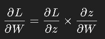

### Professional Definition (For Interview):
Backpropagation, short for "backward propagation of errors," is an algorithm used to train artificial neural networks. It is a supervised learning technique that involves two main steps: forward propagation and backward propagation.

- **Forward Propagation**: In this step, input data passes through the network layer by layer, with each layer performing specific computations on the data and producing an output. The final output is compared to the actual target (or label) to calculate the loss or error.

- **Backward Propagation**: This is the key part of the algorithm. The error calculated during forward propagation is propagated backward through the network, layer by layer. During this backward pass, the algorithm computes the gradient of the loss function with respect to each weight in the network. These gradients indicate how much the weights contribute to the error.

Using these gradients, the algorithm updates the weights using an optimization method (e.g., gradient descent) to minimize the loss function. This process is repeated over multiple iterations (epochs) until the network's predictions are sufficiently accurate.

### Detailed Use Cases and Examples:

1. **Training a Neural Network for Image Recognition**:
   - **Problem**: Consider a convolutional neural network (CNN) trained to recognize handwritten digits (0-9) using the MNIST dataset.
   - **Forward Propagation**:
     - The input image of a digit is passed through several layers of the network (convolutional layers, pooling layers, fully connected layers), each performing specific operations. The final output is a prediction of which digit the network thinks is in the image.
   - **Error Calculation**:
     - The network's prediction is compared to the actual digit (the true label). The difference between the predicted value and the actual value is the error or loss.
   - **Backward Propagation**:
     - The error is propagated back through the network, starting from the output layer and moving towards the input layer. The algorithm calculates the gradient of the loss function with respect to each weight in the network.
     - These gradients tell the network how to adjust the weights to reduce the error in the next iteration. For instance, if a weight contributed to an incorrect prediction, it will be reduced; if it contributed to a correct prediction, it might be increased.
   - **Weight Update**:
     - The weights are updated based on the gradients, typically using an optimization method like stochastic gradient descent (SGD).
   - **Iteration**:
     - This process repeats for many epochs, with the network gradually improving its accuracy in recognizing digits.

2. **Natural Language Processing (NLP) for Sentiment Analysis**:
   - **Problem**: Training a neural network to classify the sentiment of movie reviews as positive or negative.
   - **Forward Propagation**:
     - A review is fed into the network, which processes it through several layers (e.g., embedding layers, LSTM layers, dense layers) to produce a sentiment score (e.g., a probability that the review is positive).
   - **Error Calculation**:
     - The network’s output is compared to the actual label (positive or negative), and the error is calculated.
   - **Backward Propagation**:
     - The error is propagated back through the network, adjusting the weights in each layer based on how much they contributed to the error.
   - **Weight Update**:
     - The network updates its weights to minimize the error in future predictions.
   - **Iteration**:
     - Over multiple epochs, the network becomes better at correctly classifying reviews as positive or negative.

3. **Deep Reinforcement Learning**:
   - **Problem**: Training an agent to play a game, such as Atari Pong.
   - **Forward Propagation**:
     - The agent takes an action (e.g., moving the paddle) based on its current policy (a neural network that outputs the best action given the current game state).
   - **Reward and Error Calculation**:
     - The agent receives a reward based on the outcome of the action (e.g., +1 for hitting the ball, -1 for missing). The difference between the expected reward and the actual reward is the error.
   - **Backward Propagation**:
     - The error is backpropagated through the network, adjusting the policy to make better decisions in the future.
   - **Weight Update**:
     - The weights in the policy network are updated to increase the likelihood of successful actions.
   - **Iteration**:
     - Through many iterations, the agent learns to optimize its actions, improving its performance in the game.

### Mathematical Insight:

- **Chain Rule**: Backpropagation relies on the chain rule of calculus to compute the gradients of the loss function with respect to each weight. If **L** is the loss function, and **W** are the weights, backpropagation calculates:  
    
  Where (&#x0225;) is the output of a neuron or a layer. This process continues backward through each layer.

- **Gradient Descent**: The computed gradients are used to update the weights as follows:  
  ### formula to be filled 
  Here, <b>&alpha;</b> is the learning rate that controls the size of the weight updates.

### Importance of Backpropagation:
Backpropagation is essential because it allows neural networks to learn complex patterns in data by adjusting the weights in a way that minimizes the prediction error. Without backpropagation, training deep neural networks would be infeasible due to the complexity of computing gradients for large numbers of parameters.