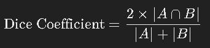

### 1. Dice Coefficient
**Dice Coefficient** (also known as the Dice Similarity Coefficient or DSC) is a metric used to measure the similarity between two sets, commonly used in image segmentation tasks to evaluate the overlap between the predicted segmentation mask and the ground truth mask.

- **Formula:**  
   
  Where:
  - |A &cup; B| is the number of pixels in both the predicted and ground truth masks (i.e., the intersection).
  - |A| is the number of pixels in the predicted mask.
  - |B| is the number of pixels in the ground truth mask.

- **Interpretation:**
  - **Dice Coefficient = 1:** Perfect overlap between the predicted and ground truth masks.
  - **Dice Coefficient = 0:** No overlap at all.
  - The Dice Coefficient ranges from 0 to 1, with higher values indicating better performance.

- **Use Case:** It is especially useful in medical image segmentation where precise overlap between predicted and actual regions (e.g., tumors, organs) is critical.

### 2. Pixel Accuracy
**Pixel Accuracy** is a simple metric used to evaluate the performance of segmentation models by calculating the proportion of correctly classified pixels in the image.

- **Formula:**  
  

- **Interpretation:**
  - **Pixel Accuracy = 1:** All pixels are correctly classified.
  - **Pixel Accuracy = 0:** None of the pixels are correctly classified.
  - Higher pixel accuracy values indicate better performance.

- **Limitations:** While pixel accuracy provides a general sense of model performance, it can be misleading in cases of imbalanced datasets where one class (e.g., background) dominates the image. In such cases, the model might achieve high pixel accuracy by correctly classifying the majority class while failing on minority classes.

### Summary
- **Dice Coefficient** is more sensitive to small objects or regions and is generally preferred in medical or other specialized image segmentation tasks where precise overlap is crucial.
- **Pixel Accuracy** gives a broad overview of how well the model performs across the entire image but may not fully capture the performance in cases of class imbalance or when minority classes are of particular interest.